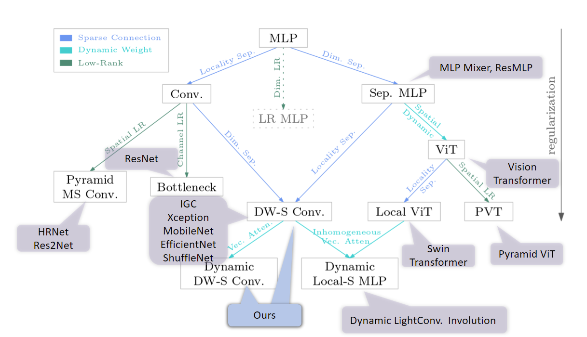

# Demysitifing Local Vision Transformer, [arxiv](https://arxiv.org/pdf/2106.04263.pdf)

This is the official PyTorch implementation of our paper. We simply replace local self attention by (dynamic) depth-wise convolution with lower computational cost. The performance is on par with the Swin Transformer.

Besides, the main contribution of our paper is the theorical and detailed comparison between depth-wise convolution and local self attention from three aspects: sparse connectivity, weight sharing and dynamic weight. By this paper, we want community to rethinking the local self attention and depth-wise convolution, and the basic model architeture designing rules.

<p align="center">
  
</p>

Codes and models for object detection and semantic segmentation are avaliable in *[Detection](https://github.com/Atten4Vis/DemystifyLocalViT/tree/master/downstreams/detection) and [Segmentation](https://github.com/Atten4Vis/DemystifyLocalViT/tree/master/downstreams/segmentation).*

We also give MLP based Swin Transformer models and Inhomogenous dynamic convolution in the ablation studies. These codes and models will coming soon.


## Reference
```
@article{han2021demystifying,
  title={Demystifying Local Vision Transformer: Sparse Connectivity, Weight Sharing, and Dynamic Weight},
  author={Han, Qi and Fan, Zejia and Dai, Qi and Sun, Lei and Cheng, Ming-Ming and Liu, Jiaying and Wang, Jingdong},
  journal={arXiv preprint arXiv:2106.04263},
  year={2021}
}
```
## 1. Requirements
torch>=1.5.0, torchvision, [timm](https://github.com/rwightman/pytorch-image-models), pyyaml; apex-amp

data perpare: ImageNet dataset with the following structure:
```
│imagenet/
├──train/
│  ├── n01440764
│  │   ├── n01440764_10026.JPEG
│  │   ├── n01440764_10027.JPEG
│  │   ├── ......
│  ├── ......
├──val/
│  ├── n01440764
│  │   ├── ILSVRC2012_val_00000293.JPEG
│  │   ├── ILSVRC2012_val_00002138.JPEG
│  │   ├── ......
│  ├── ......
```

## 2. Trainning
For tiny model, we train with batch-size 128 on 8 GPUs. When trainning base model, we use batch-size 64 on 16 GPUs with OpenMPI to keep the total batch-size unchanged. (With the same trainning setting, the base model couldn't train with AMP due to the anomalous gradient values.)

Please change the data path in sh scripts first.

For tiny model:
```bash
bash scripts/run_dwnet_tiny_patch4_window7_224.sh 
bash scripts/run_dynamic_dwnet_tiny_patch4_window7_224.sh
```
For base model, use multi node with OpenMPI:
```bash
bash scripts/run_dwnet_base_patch4_window7_224.sh 
bash scripts/run_dynamic_dwnet_base_patch4_window7_224.sh
```

## 3. Evaluation
```
python -m torch.distributed.launch --nproc_per_node 1 --master_port 12345 main.py --cfg configs/change_to_config_file --resume /path/to/model --data-path /path/to/imagenet --eval
```

## 4. Models
Models are provided by training on ImageNet with resolution 224.

| Model |  #params | FLOPs | Top1 Acc| Download | 
| :---     |   :---:    |  :---: |  :---:  |  :---:  |
dwnet_tiny | 24M   | 3.8G  |  81.2   |  [github](https://github.com/Atten4Vis/DemystifyLocalViT/releases/download/prerelease/dwnet_tiny_224.pth) |
dynamic_dwnet_tiny | 51M   | 3.8G  |  81.8   |  [github](https://github.com/Atten4Vis/DemystifyLocalViT/releases/download/prerelease/dynamic_dwnet_tiny_224.pth) |
dwnet_base | 74M   | 12.9G  |  83.2   |  [github](https://github.com/Atten4Vis/DemystifyLocalViT/releases/download/prerelease/dwnet_base_224.pth) |
dynamic_dwnet_base | 162M   | 13.0G  |  83.2   |  [github](https://github.com/Atten4Vis/DemystifyLocalViT/releases/download/prerelease/dynamic_dwnet_base_224.pth) |


Detection (see [Detection](https://github.com/Atten4Vis/DemystifyLocalViT/tree/master/downstreams/detection) for details): 
| Backbone | Pretrain | Lr Schd | box mAP | mask mAP | #params | FLOPs | config | model |
| :---: | :---: | :---: | :---: | :---: | :---: | :---: | :---: | :---: |
| DWNet-T | ImageNet-1K | 3x | 49.9 | 43.4 | 82M | 730G | [config](downstreams/detection/configs/dwnet/cascade_mask_rcnn_dwnet_tiny_patch4_window7_mstrain_480-800_giou_4conv1f_adamw_3x_coco.py) | [github](https://github.com/Atten4Vis/DemystifyLocalViT/releases/download/prerelease/cascade_mask_rcnn_dwnet_tiny.pth)|
| DWNet-B | ImageNet-1K | 3x | 51.0 | 44.1 | 132M | 924G | [config](downstreams/detection/configs/dwnet/cascade_mask_rcnn_dwnet_base_patch4_window7_mstrain_480-800_giou_4conv1f_adamw_3x_coco.py) | [github](https://github.com/Atten4Vis/DemystifyLocalViT/releases/download/prerelease/cascade_mask_rcnn_dwnet_base.pth)|
| Dynamic-DWNet-T | ImageNet-1K | 3x | 50.5 | 43.7 | 108M | 730G | [config](downstreams/detection/configs/dwnet/cascade_mask_rcnn_dynamic_dwnet_tiny_patch4_window7_mstrain_480-800_giou_4conv1f_adamw_3x_coco.py) | [github](https://github.com/Atten4Vis/DemystifyLocalViT/releases/download/prerelease/cascade_mask_rcnn_dynamic_dwnet_tiny.pth)|
| Dynamic-DWNet-B | ImageNet-1K | 3x | 51.2 | 44.4 | 219M | 924G | [config](downstreams/detection/configs/dwnet/cascade_mask_rcnn_dynamic_dwnet_base_patch4_window7_mstrain_480-800_giou_4conv1f_adamw_3x_coco.py) | [github](https://github.com/Atten4Vis/DemystifyLocalViT/releases/download/prerelease/cascade_mask_rcnn_dynamic_dwnet_base.pth)|

Segmentation (see [Segmentation](https://github.com/Atten4Vis/DemystifyLocalViT/tree/master/downstreams/segmentation) for details):
| Backbone | Pretrain | Lr Schd | mIoU | #params | FLOPs | config | model |
| :---: | :---: | :---: | :---: | :---: | :---: | :---: | :---: |
| DWNet-T | ImageNet-1K | 160K | 45.5 | 56M | 928G | [config](downstreams/segmentation/configs/dwnet/upernet_dwnet_tiny_patch4_window7_512x512_160k_ade20k.py) | [github](https://github.com/Atten4Vis/DemystifyLocalViT/releases/download/prerelease/upernet_dwnet_tiny.pth)|
| DWNet-B | ImageNet-1K | 160K | 48.3 | 108M | 1129G | [config](downstreams/segmentation/configs/dwnet/upernet_dwnet_base_patch4_window7_512x512_160k_ade20k.py) | [github](https://github.com/Atten4Vis/DemystifyLocalViT/releases/download/prerelease/upernet_dwnet_base.pth)|
| Dynamic-DWNet-T | ImageNet-1K | 160K | 45.7 | 83M | 928G | [config](downstreams/segmentation/configs/dwnet/upernet_dynamic_dwnet_tiny_patch4_window7_512x512_160k_ade20k.py) | [github](https://github.com/Atten4Vis/DemystifyLocalViT/releases/download/prerelease/upernet_dynamic_dwnet_tiny.pth)|
| Dynamic-DWNet-B | ImageNet-1K | 160K | 48.0 | 195M | 1129G | [config](downstreams/segmentation/configs/dwnet/upernet_dynamic_dwnet_base_patch4_window7_512x512_160k_ade20k.py) | [github](https://github.com/Atten4Vis/DemystifyLocalViT/releases/download/prerelease/upernet_dynamic_dwnet_base.pth)|

## LICENSE
This repo is under the MIT license. Some codes are borrow from [Swin Transformer](https://github.com/microsoft/Swin-Transformer).
